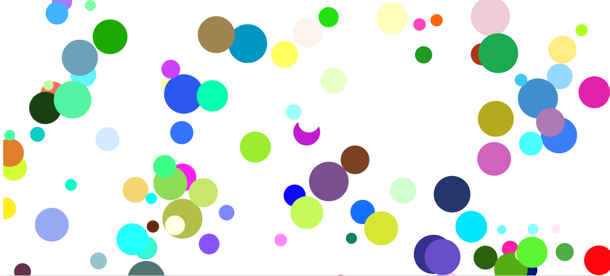

# Welcome to Jamiel's Project 1!

## How to view the piece
To get started with the piece, once the instructions are shown, click okay to start it.

## Piece Interaction
To interact with the piece, click on the white circle after it finished moving into view.

After that, you can click on various circles to change the piece.

# Purpose
The purpose of this piece is to show the viewer the different perspectives of people and how each perspective is a unique way of seeing the world around them.

The beginning of the piece starts with a black background to represent nothingness. There is nothing being shown to the viewer and no perspective is being shown. 

The white circle that grows from the center represents the initial perspective, not influenced or biased by any perspective at all.

Once the user clicks on the white circle, the white circle will grow from the center. Thus stepping into the initial perspective.

Once the background is white, we are now viewing the world in the initial perspective. We see different and unique perspectives of the world, represented as circles on the screen. The viewer can click on any of the circles to change the perspective. 

When the viewer clicks on a circle, the perspective being clicked is then expanded to show that we are "entering" its perspective. To show we are in the new perspective, the background colors is the same color as the circle that was pressed. The presentation of the circles change and the viewer can see the world in a different and unique perspective.

Each time a new perspective is being entered, the new perspective takes some influence from prior perspectives, thus adding the uniqueness and individuality of each perspective.

This provides the viewer a truly random and unique perspective each time a new one is entered.